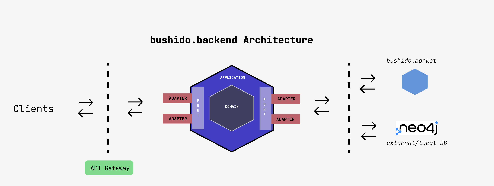

# Motivation
The web server for [bushido.guide](https://bushido.guide). It has two main tasks: Get the repository domains and P2P market offers.

# Overview

bushido.backend is implemented using Hexagonal Architecture pattern and it has mainly three layers:

- __Infrastructure__: To access into the system, users or external services, it uses ports and adapters. __Ports__ determines the interface for external actors to communicate with the application and __adapters__ will initiate the interaction with the Application
- __Application__: It takes all the events related with the infrastructure layer and it passes through the domain layer. In that case, it uses __CQRS__ pattern to achieve the communication with the domain layer and there are two types of models: `commands`, usually uses to mutate domain data and `query` to render information to the requested party, there is not domain mutation in that model
- __Domain__: The layer that holds all the business logic and the rules 



## Domain
It has different aggregates to represent application entities:
- __Cards__: This aggregate can be *topic* and *domain* type and each one has its own duties. Topic, is the the group that wraps the related domains and *domain* is the web page url
- __Market__: The responsible to fetch the exchanges offers


### Launch the server
Before launch the server, we have to import bushido.library domains. Once we populate the database with domains and topics, we can launch the server:
```bash
npm run start:dev
```

### GraphQL queries
If we want to enter in the apollo client from the browser, we have to deactivate **CORS** in the *bootstrap* procedure.
- GraphQL web server: localhost:4000/graphql

### Container
- We might need to create a network inside docker: `docker network create bushido-network`
